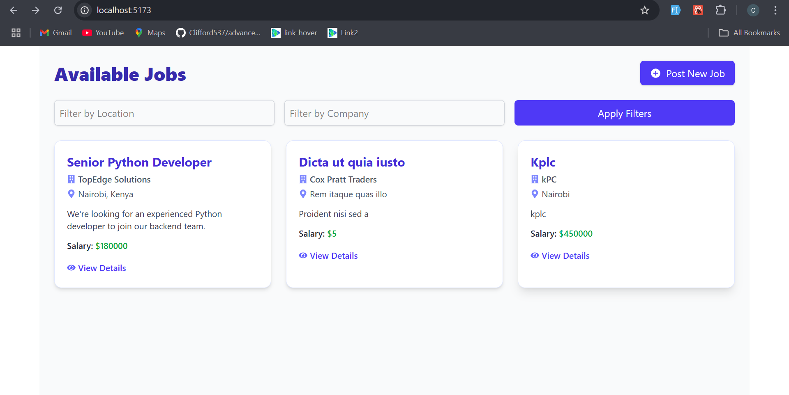
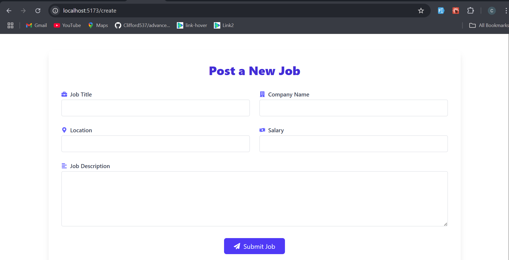
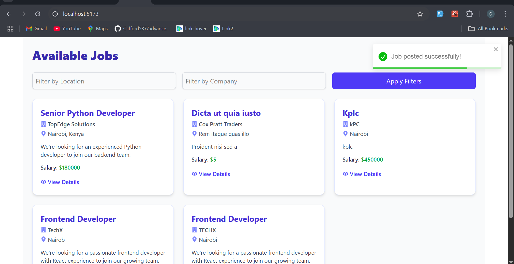
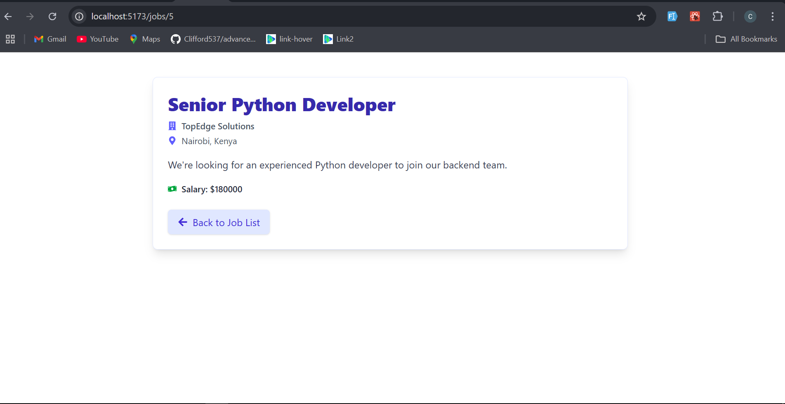

# Job Managemet system (React + Django)

A modern job listing board built with **React** for the frontend and **Django REST Framework** for the backend. Users can browse, post, and view job listings through a clean, responsive UI.

---

## 🚀 Features

- List all active job posts
- Create a new job
- View detailed job info
- Filter jobs by company or location
- React Icons, Toast Notifications, and Tailwind styling

---

## 📁 Project Structure

Both frontend and backend are inside this directory:

```
/job-board-project
├── backend/    ← Django project
├── frontend/   ← React app
├── IMG1.png   ← Job List Screenshot
├── IMG2.png   ← Job Create Form
├── IMG3.png   ← Job Details View
├── IMG4.png   ← Job Creation Success Toast
└── README.md
```

---

##  Backend Setup (Django)

###  Requirements:
- Python 3.8+
- pip / virtualenv

###  Setup & Run:

```bash
#On the root folder create a virtual environment and activate then install the dependancies
python -m venv venv
source venv/bin/activate  # or venv\Scripts\activate on Windows
pip install -r requirements.txt

# Change the database configurations in settings apply migrations and run the server
cd backend
python manage.py makemigrations
python manage.py migrate
python manage.py runserver
```

> The API will be running at: **http://localhost:8000/api/jobs/**

---

## ⚛️ Frontend Setup (React + Vite)

### 📦 Requirements:
- Node.js (v16+ recommended)
- npm or yarn

### ⚙️ Setup & Run:

```bash
cd frontend/jobmanagementsysfrontend
npm install
npm run dev
```

> The React app will run at: **http://localhost:5173**

---

##  CORS Note

Ensure Django CORS is configured to allow React access. In `backend/job_management/settings.py`:

```python
INSTALLED_APPS += ['corsheaders']
MIDDLEWARE = ['corsheaders.middleware.CorsMiddleware'] + MIDDLEWARE
CORS_ALLOW_ALL_ORIGINS = True  # For dev only
```

---

## 🛠 Technologies Used

- **Frontend**: React + Tailwind CSS + React Router + React Icons + Axios + Toastify
- **Backend**: Django + Django REST Framework
- **Database**: SQLite (default) or PostgreSQL (optional)

---

## 📸 Screenshots

### 🗂 Job List View


### 📝 Job Create Form


### 📄 Job Created Toast


### ✅ Job Detail View


---

##  Author

**Clifford Mukosh**  
_“Code with purpose, design with care.”_

---


